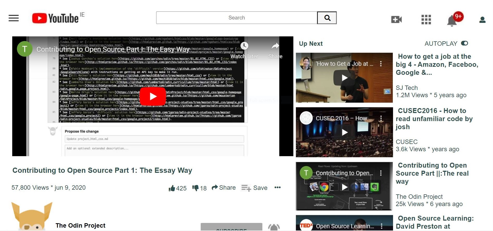

# embeded-video-project

> this project is an attempt to replicate the look and feel of the popular internet media player, youTube Channel.

## Built With

- html & css,
- Visual Studio Code, Git and Github.

## Live Demo
[Live Demo Link](https://digitekh2i.github.io/embeded-video-project/)

## Authors

👤 **Author1**

- Github: [@digitekh2i](https://https://github.com/digitekh2i)
- Twitter: [@ObokoDaniel](https://twitter.com/ObokoDaniel)
- Linkedin: [linkedin](http://linkedin.com/in/daniel-dikachi-1luvtek101)

## 🤝 Contributing

Contributions, issues and feature requests are welcome!

Feel free to check the [issues page](issues/).

## Show your support

Give a ⭐️ if you like this project!

## Acknowledgments

- Hat tip to anyone whose code was used
- Inspiration
- etc

## 📝 License

This project is [MIT](lic.url) licensed.
